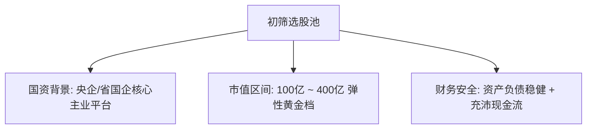
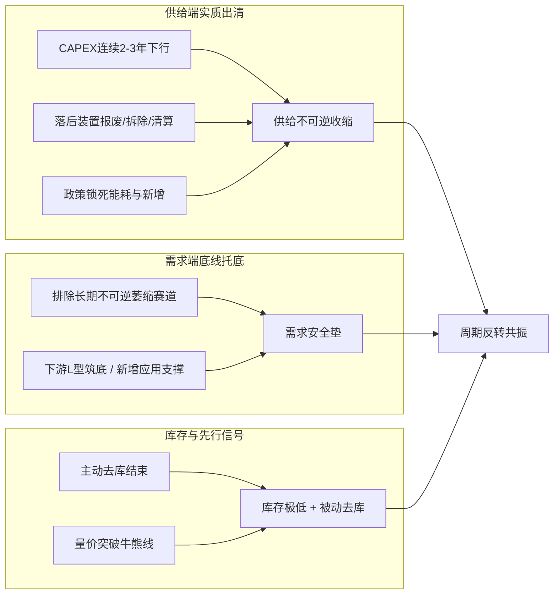
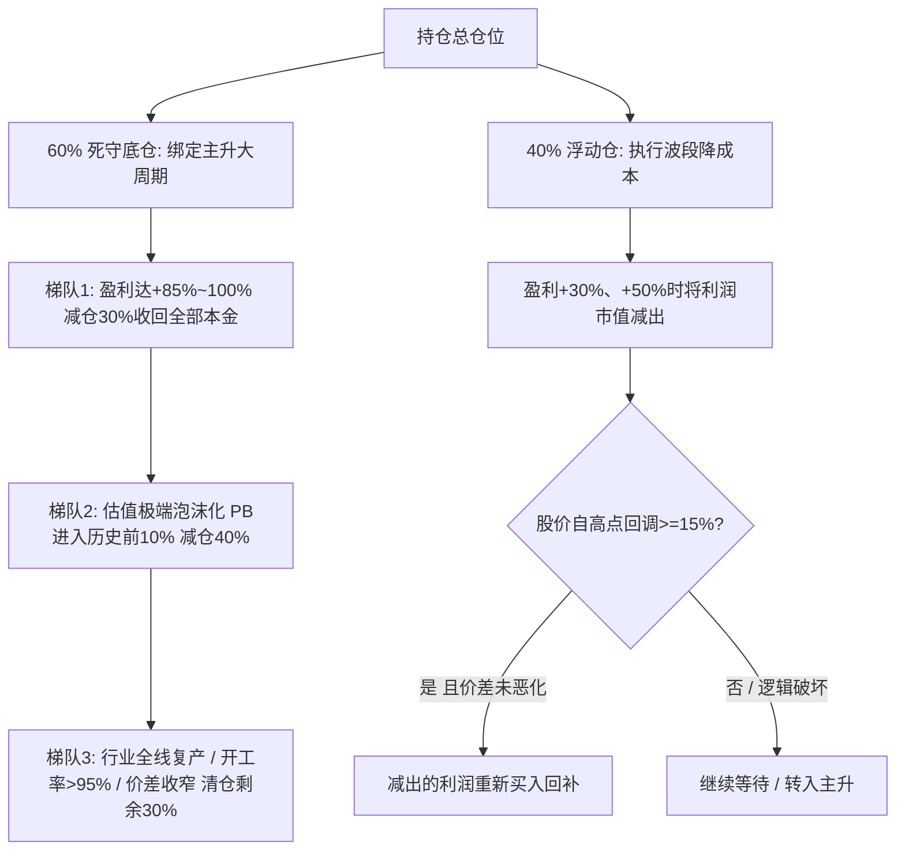

# 周期反转与细分国企隐形冠军·全流程交易体系（实战标准版 V3.5）

---

## 一、 体系底层定位与选股池约束（Universe）

1. **企业性质与集团地位**：
   * 必须为**国务院国资委控股央企**或**省国资委控股重点国企**。
   * 必须是集团旗下的**战略核心主业平台**或**专业化产业整合承接主体**；坚决剔除集团边缘、缺乏资源赋能的“壳类/边缘”资产。
2. **市值与弹性空间**：
   * 总市值严格限定在 **100 亿 ～ 400 亿** 区间。
   * 既确保具备细分赛道的规模壁垒与抗风险能力，又具备周期爆发时的股价弹性（避免 >500 亿的大盘钝化，防范 <50 亿的小市值流动性与抗风险陷阱）。
3. **财务安全硬底线**：
   * 资产负债率处于行业安全区间，现金储备充沛。
   * 经营性现金流具备抗周期硬度，无不可承受的非主业担保、大额商誉减值与应收账款恶化风险。

---

## 二、 主营业务与真实护城河（Moats）

4. **业务纯粹与专注度**：
   * 单一主营业务营收或利润占比 $\ge 60\%$，在细分赛道做到**国内前三或全球前列**。
   * 警惕“伪专注”：产品线杂乱、各项产品均无定价权的企业坚决剔除。
5. **真实全成本领先（核心壁垒）**：
   * 全要素现金成本（包含原料自给率、能耗、运费、折旧）处于行业**左侧前 20%**。
   * **逆境检验**：在全行业亏损期，公司仍能维持**毛利为正或现金流平衡**；坚决剔除为了完成考核而搞“失血式降价内卷”的伪龙头。
6. **驱动变量极简透明**：
   * 核心利润驱动变量 $\le 3$ 个（如：产品 A 价格、核心原料 B 价格、开工负荷）。
   * 上下游具备**高频、公开的市场价格数据**可严密跟踪，拒绝业务模式黑盒。

---

## 三、 供需格局双向验证（Supply & Demand）

7. **供给端实质性收缩（硬约束）**：
   * 行业资本开支（CAPEX）连续 2~3 年下行，新增产能受环保、能耗或产业政策严密锁死。
   * 同行出现**不可逆退出**（工厂关闭、装置拆除报废、破产清算），而非短期停产检修。
8. **需求端底线约束（防死水）**：
   * 坚决排除下游面临“长期不可逆消亡”的赛道（如地产强相关且无转型的传统建材）。
   * 需求端至少满足**“L 型筑底、库存去化充分”**，或具备结构性新应用拉动。
9. **库存周期转向与量价先行代理**：
   * 行业处于从“主动去库存”向“被动去库存/补库初期”转折的临界点。
   * **数据滞后补偿**：当产业数据尚未完全公开，但盘面出现**放量突破 120/250 日均线且周线底背离**时，视为产业资本抢跑的先行信号。

---

## 四、 估值锚点与非线性弹性测算（Valuation）

10. **底部估值锚点（纠正 PE 误区）**：
    * **买入看 PB 与重置成本**：历史 PB 分位数 $< 15\%$，或总市值接近/跌破资产重置成本（破净或接近净资产）。
    * **严禁底部看 PE**：周期底部 PE 往往极高或为负，低 PE 多出现在周期顶部或下行初期（价值陷阱）。
11. **非线性利润弹性测算**：
    * $$\text{潜在合理市值} = (\text{常态化吨毛利} \times \text{合规产能} - \text{固定三费税费}) \times \text{行业中枢 PE} \times 0.75\text{（安全折扣）}$$
    * **赔率底线**：潜在合理市值 $\div$ 当前市值 $\ge 2.0$ 倍。

---

## 五、 买入决策矩阵与分级建仓（Entry Matrix）

### 1. 三票否决项（必须全部满足，任一不满足直接放弃）
* [ ] **【财务安全】** 资产负债率处于安全区间，现金流充沛，无暴雷与大额减值风险。
* [ ] **【需求底线】** 下游需求处于筑底期，非长期不可逆衰退赛道。
* [ ] **【绝对低估】** $PB \le 1.5$ 且处于历史估值底部，股价经历 1 年以上深度震荡筑底。

---

### 2. 核心驱动项（每项 20 分，满分 60 分）
* [ ] **【供给实质出清】** 落后产能实质性关停报废，政策锁死新增。（20分）
* [ ] **【真实成本领先】** 公司全成本处于行业前 $20\%$，逆境下具备现金造血能力。（20分）
* [ ] **【价差拐点初现】** “产品-原料”剪刀差停止恶化，开始走阔。（20分）

---

### 3. 辅助催化项（每项 10 分，满分 40 分）
* [ ] **【产业整合催化】** 大股东具备明确的优质资产注入、并购整合预期。（10分）
* [ ] **【高频库存极低】** 产业链全环节去库彻底，具备强补库弹性。（10分）
* [ ] **【龙头份额集中】** 行业开工低迷而公司开工/订单逆势扩张。（10分）
* [ ] **【资本运作信号】** 底部持续放量承接，或大股东增持/回购注销/股权激励。（10分）

---

### 4. 仓位与执行规则
| 否决项状态 + 综合得分 | 仓位级别 | 执行动作与阶段属性 |
| :---: | :---: | :--- |
| **存在任意否决项不满足** | **0 仓位** | **坚决不买**，防范价值陷阱与本金永久性损失。 |
| **全过 + $40 \sim 50$ 分** | **底仓（1~2成）** | **阶段一（左侧防御）**：以极低 PB 分批建底仓，承受磨底时间。 |
| **全过 + $60 \sim 70$ 分** | **中仓（3~5成）** | **阶段过渡**：核心逻辑成立，等待关键催化剂确认。 |
| **全过 + $\ge 80$ 分** | **重仓（6~8成）** | **阶段二（右侧爆发）**：价差走阔 + 催化剂激活，重仓出击。 |

---

## 六、 仓位结构与双轨制卖出闭环（Exit System）

为解决“震荡期被洗出”与“主升浪过早下车”的矛盾，**持仓仓位实行物理隔离管理**：

### 1. 浮动仓（40% 仓位）—— 执行【波段降成本法】
* **执行条件**：标的处于底部震荡期、或脉冲式反弹阶段。
* **规则**：
  1. 股价自买入点上涨，**盈利达 $+30\%$ 和 $+50\%$ 时，分别将“利润对应的市值”减仓兑现**，保留全部原始本金。
  2. **利润回补条件（必须双重满足）**：
     * **价格信号**：股价自阶段高点回调 $\ge 15\%$ 且在关键支撑位企稳。
     * **基本面信号**：**产品-原料价差未恶化、行业出清逻辑未被破坏**。

---

### 2. 底仓（60% 仓位）—— 执行【三阶梯大周期退出法则】
* **执行条件**：核心催化剂落地，剪刀差持续扩大，主升浪确认（**坚决禁用小波段频繁做 T**）。
* **三阶梯离场规则**：
  * **第一梯队（底仓的 30%）—— 本金安全锁**：
    * 当总盈利达到 **$+85\% \sim +100\%$** 时减仓，**彻底收回全部原始本金**，剩余持仓进入“零成本博弈”。
  * **第二梯队（底仓的 40%）—— 估值泡沫兑现**：
    * 当 **PB 触及历史前 $10\%$ 极端分位**，或动态 PE 降至极低（如 $<8$ 倍）掩护主力出货时，减仓 40%。
  * **第三梯队（底仓的 30%）—— 基本面终极离场**：
    * 出现以下**见顶信号**时，全线清仓：
      * 行业此前停产装置全线复产，全行业开工率 $> 95\%$；
      * 产品-原料价差连续 2~3 周环比明显收窄；
      * 行业龙头密集宣布百亿级新增产能扩张规划。

---

## 七、 组合风控、冷冻线与逻辑证伪（Risk Control）

1. **组合层面分散约束**：
   * 单只周期股持仓上限 $\le 25\%$。
   * 整体投资组合必须分散在 **3~4 个低相关性的细分周期子行业**（如农化、特种金属、精细化工、专用设备），防范单一宏观黑天鹅。
2. **账户级“流动性冷冻线”**：
   * 若单票浮亏达 $-25\%$ 且基本面逻辑未被证伪，**暂停一切逆势加仓动作，只允许持有**，严禁过早耗尽后备流动性。
3. **逻辑证伪与一票清仓（非机械止损）**：
   * 触碰以下红线，次日开盘无条件清仓止损：
     * ❌ **工艺替代**：行业出现成本显著更低的新工艺、新路线，原有壁垒彻底瓦解。
     * ❌ **财务失真**：公司出现大额非经营性爆雷减值、违规担保或现金流持续背离恶化。
     * ❌ **市占掉队**：在行业出清期，公司市占率反而被同行竞品持续蚕食（低效伪龙头）。
